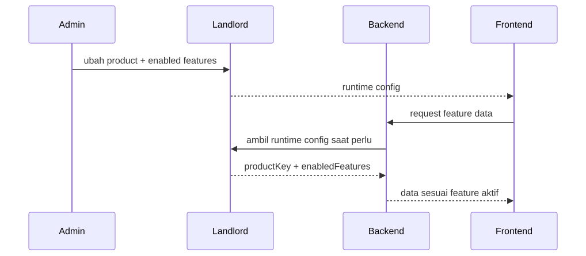

<!--
Diagram sources:
- Mermaid source: ./slides-diagrams/*.mmd
- Rendered assets: ./slides-assets/*.svg
-->

# Feature-Centric Multi-Product Modular Monolith

### Arsitektur modular LMS multi-product dalam satu codebase

- `catalog` sebagai kontrak bersama
- `landlord` sebagai pengatur runtime config tenant
- `backend` dan `frontend` mengikuti runtime config yang sama

<!--
Slide pembuka.

Tekankan bahwa ini bukan sekadar pembagian folder, tetapi pola komposisi capability:
- satu codebase
- beberapa product
- feature bisa aktif/nonaktif per tenant
- public/admin tetap satu ownership per feature
-->

---

# Problem Statement

- Satu codebase, tapi kebutuhan `school` dan `corporate` berbeda
- Tidak cukup hanya menyimpan `tenant type`
- Tanpa arsitektur, logic mudah menyebar jadi `if/else` di banyak tempat
- Coupling antar fitur akan cepat naik
- Tidak ada source of truth yang jelas untuk product dan feature

<!--
Pesan utama:
- masalah utamanya bukan "bagaimana tahu tenant ini school atau corporate"
- masalah utamanya adalah bagaimana membatasi penyebaran keputusan itu
- kalau tidak ada boundary, pembeda product akan bocor ke route, page, service, dan query di mana-mana
-->

---

# Goals

- Mendukung beberapa jenis LMS
- Feature bisa berbeda, tapi tetap satu codebase
- Feature bisa diaktif/nonaktif per tenant
- Shared dan product-specific feature bisa diorganisir jelas
- `frontend`, `backend`, dan `landlord` membaca kontrak yang sama
- Masih bisa tumbuh ke product baru atau tenant-specific product

<!--
Jelaskan bahwa "feature" di sini mencakup:
- halaman
- route
- widget
- admin/public exposure

Goal utamanya adalah menjaga pertumbuhan tetap terkendali.
-->

---

# Proposed Solution

- **Feature-Centric**
  - boundary utama adalah feature
- **Multi-Product**
  - satu codebase melayani beberapa product
- **Modular Monolith**
  - backend tetap satu app, tetapi modular per feature

<!--
Ini nama formal arsitekturnya.

Kalau perlu singkatkan saat presentasi:
"Feature-Centric Multi-Product Architecture"

Tekankan bahwa backend bukan microservices, tetapi modular monolith.
-->

---

# Core Taxonomy

- `resource` = unit CRUD / objek data
- `feature` = capability bisnis
- `product` = kombinasi feature
- `catalog` = source of truth product + feature

<!--
Contoh narasi:
- course, chapter, lesson = resource
- courses = feature
- school = product
- catalog = daftar product dan feature beserta compatibility

Tujuan slide ini adalah menyamakan istilah dulu sebelum masuk ke detail implementasi.
-->

---

# Feature as the Main Boundary

- Resource tidak berdiri sendiri di level arsitektur
- Ownership utama ada di feature
- Satu feature bisa punya:
  - routes
  - pages
  - services
  - models
  - widgets

<!--
Tekankan:
- kita tidak mendesain arsitektur di level CRUD item
- kita mendesain di level capability
- satu feature boleh memayungi beberapa resource dan beberapa bentuk exposure
-->

---

# Product = Composition of Features

- Product bukan tempat implementasi
- Product adalah hasil komposisi feature
- Feature bisa:
  - shared
  - product-specific

<!--
Contoh nyata di v2:
- shared: courses
- school: classes, guardians
- corporate: compliance, teams

Poin penting: product tidak "memiliki" implementasi route/page langsung.
Implementasi tetap tinggal di feature.
-->

---

# Surface Lives Inside Feature

- `public` dan `admin` adalah **surface**
- Surface adalah variasi exposure dari feature yang sama
- Jika feature nonaktif, semua surface-nya ikut nonaktif

<!--
Ini alasan kenapa kita tidak pakai struktur surface-first.

Kalau feature dimatikan:
- public route hilang
- admin route hilang
- widget contribution hilang

Boundary tetap konsisten karena ownership ada di feature.
-->

---

# Widgets Are Surface-Specific Contributions

- Widget bukan surface baru
- Widget adalah kontribusi kecil milik feature
- Widget dirender pada slot tertentu di dalam surface tertentu

<!--
Contoh di v2:
- courses punya widget di public home dan admin home
- classes juga bisa contribute widget, tetapi tetap ikut runtime gating

Host page tidak import widget feature satu per satu.
Host hanya menyediakan slot.
-->

---

# Catalog as Shared Contract

- Mendefinisikan:
  - daftar product
  - daftar feature
  - compatibility matrix
  - metadata dasar
- Dipakai lintas `frontend`, `backend`, dan `landlord`
- Menjadi source of truth yang netral

<!--
Tekankan bahwa catalog tidak menyimpan:
- wiring UI
- route implementation
- business logic

Catalog hanya kontrak dasar yang dishare semua project.
-->

---

# Tenant, Product, and Feature Toggle

- Tenant memilih salah satu product
- Feature pada product itu bisa on/off
- Ini membuka jalan untuk product khusus tenant

<!--
Saat presentasi, jelaskan bahwa saat ini landlord di demo masih single-tenant.

Tapi pola ini sudah cocok untuk multi-tenant:
- tenant memilih product
- enabledFeatures disimpan per tenant
-->

---

# Runtime Flow

- `landlord` adalah source of truth runtime config
- `frontend` bootstrap dari `landlord`
- `backend` menggunakan runtime config untuk gating feature

<!--
Sesuaikan narasi dengan arah terbaru yang sedang dipikirkan:
- source of truth tetap di landlord
- frontend bootstrap lewat HTTP
- backend tidak seharusnya bergantung pada webhook untuk sinkronisasi cluster

Kalau mau, sebutkan bahwa pola sinkronisasi backend masih bisa dievolusi.
-->

---

# Feature Registration

- Tiap feature punya directory sendiri
- Semua contribution feature dikumpulkan ke satu `manifest`
- Registry hanya membaca manifest, lalu merakit

<!--
Contoh contribution yang dibawa manifest:
- routes
- nav items
- widgets
- surface availability

Registry tidak perlu tahu detail implementasi tiap feature.
-->

---

# Why Use a Manifest?

- Memisahkan **deklarasi** dari **implementasi**
- Semua feature bicara lewat shape yang sama
- Registrasi jadi data-driven, bukan wiring manual
- Lebih mudah tumbuh ke route, nav, widget, dan surface lain

<!--
Kontraskan dengan direct registration:
- registry import satu-satu routes, widgets, nav items
- knowledge tentang feature bocor ke luar
- lama-lama registry jadi imperative dan gemuk

Manifest membuat registry tetap tipis.
-->

---

# Why Keep Surface Inside Feature?

- Feature tetap menjadi boundary utama
- `public` dan `admin` hanya variasi exposure
- Satu feature bisa hilang utuh saat nonaktif
- Mudah menambah surface baru tanpa memecah ownership

<!--
Kalau nanti ada surface lain:
- mobile
- instructor
- partner

Pola tetap sama: surface berada di dalam feature, bukan sebaliknya.
-->

---

# What Has Been Proven in `v2`

- `catalog` sudah menjadi kontrak bersama
- `landlord` mengelola runtime config
- `backend` dan `frontend` membaca config yang sama
- Shared dan product-specific feature sudah berjalan end-to-end
- Widget contribution juga sudah terbukti bekerja

<!--
Kalau perlu sebutkan contoh konkret:
- shared: courses
- school: classes, guardians
- corporate: compliance, teams

Dan semuanya sudah punya public/admin surface.
-->

---

# Demo Flow

1. Ubah `product` dan `enabledFeatures` di landlord
2. Reload frontend
3. Lihat route, nav, dan widget berubah
4. Akses backend API dan lihat feature gating tetap konsisten

<!--
Ini jadi bridge ke live demo.

Kalau demonya singkat:
- switch school <-> corporate
- aktif/nonaktif satu feature
- tunjukkan public/admin route berubah
- tunjukkan backend tetap 404 untuk feature yang nonaktif
-->

---

# Closing

- Kita butuh lebih dari sekadar `tenant type`
- Boundary utama harus ada di **feature**
- Product dibangun dari komposisi feature
- Catalog menjaga kontrak tetap konsisten
- Landlord memberi kontrol runtime per tenant

### Hasil akhirnya: multi-product LMS yang tetap modular dalam satu codebase

<!--
Penutup.

Kalau mau tambah next steps secara lisan:
- auth & permission
- write APIs di admin
- sync runtime config backend yang lebih cocok untuk clustered deployment
- product/tenant specialization yang lebih jauh
-->
